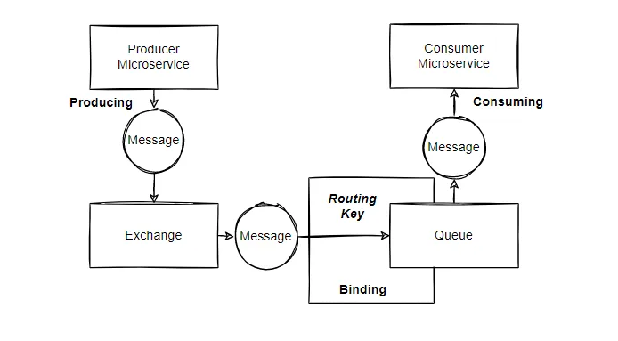

# Asynchronous Communication between Microservices with RabbitMQ
This mono repo contains two microservices projects wich I used to implement Asynchronous communication between them, using RabbitMQ.


## Prerequisites
- Docker and Docker Compose installed on your machine.

## Setup Instructions
1. **Clone the Repository**
   ```sh
   git clone https://github.com/charlybutar21/microservice-rabbitmq

2. **Start RabbitMQ with Docker**
   ```sh
   cd microservice-rabbitmq
   docker-compose up

3. **Setup RabbitMQ**

   After RabbitMQ is up and running, you need to create the necessary components:
   * Create Exchange: user.exchange
   * Create Queue: user.queue
   * Create Binding: Bind user.queue to user.exchange
   

4. **Run Microservices**

   Run producer-service and consumer-service.


5. **Send a Request**
   ```sh
   POST http://localhost:8081/api/produce
    Content-Type: application/json
 
    {
       "userId": "ID2",
       "userName": "rodriguez"
    }

6. **Verify the Data**

    Open http://localhost:8080/h2-console, 
  
    url: jdbc:h2:mem:testdb, 
    
    username: sa

    password: